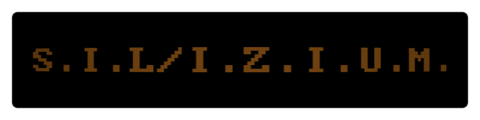

**Space In Lautern / Interaktive Zustands-Information und Monitoring**

What is this ?
--------------
A MQTT-based monitoring system for the [ChaosInkl](http://chaos-inkl.de) hackerspace.

Licenses
--------
* License for the source code: to be determined
* License for the artwork: to be determined
* Font used in Logo:
    [amstradpc1512](http://int10h.org/oldschool-pc-fonts/fontlist/#amstradpc1512)
    [CC-BY-SA4.0](static/css/font/LICENSE) by [VileR](http://int10h.org/)
* [Socket.io](http://socket.io/) [MIT License](static/js/socketio/LICENSE)
* [jquery](https://jquery.com/) [BSD License](static/js/jquery/LICENSE)
* [pure](http://purecss.io/) [BSD License](static/css/pure/LICENSE.md)
